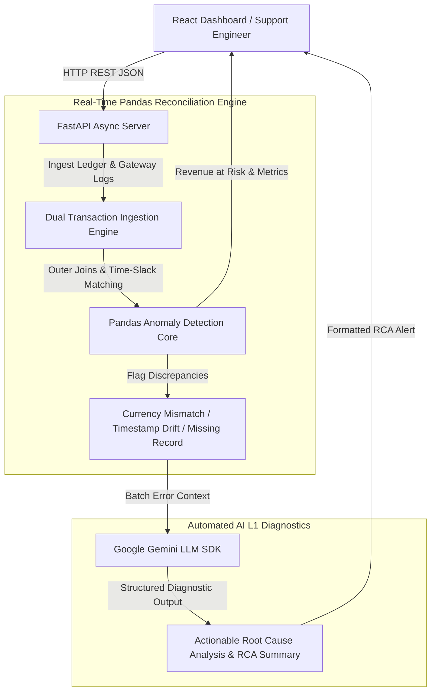

<div align="center">
  
# 🛡️ ReconAI
**AI-Powered Reconciliation Platform**

[](https://python.org)
[](https://fastapi.tiangolo.com/)
[](https://reactjs.org/)
[](https://pandas.pydata.org/)
[](https://www.docker.com/)
[](https://deepmind.google/technologies/gemini/)

> *Eliminating manual SQL queries and accelerating Mean Time to Resolution (MTTR) for enterprise payment support teams.*

### 🌐 [Live Interactive Demo](https://frontend-fawn-five-21.vercel.app/)

</div>

---

## 📈 The Business Case

**The Problem:** In FinTech, dropped or duplicated transactions between internal ledgers and third-party payment gateways (like Stripe or Plaid) cause immense customer friction. Product analysts and support engineers spend countless hours manually writing SQL joins to find missing records and diagnose the root cause. 

**The Solution:** ReconAI automates the entire reconciliation pipeline. It asynchronously ingests transaction logs, flags anomalies (currency mismatches, timestamp drifts, missing records), and utilizes Google's Gemini LLM to automatically generate actionable Root Cause Summaries for customer support teams.

## 🏗️ System Architecture & Reconciliation Flow



---

## 🚀 Core Platform Features

*   **⚡ Real-Time Reconciliation Engine:** FastAPI and Pandas backend dynamically executes outer joins and time-window slack matching to flag discrepancies across dual databases.
*   **🤖 Automated AI Diagnostics:** Integrates the Google Gemini API to analyze batches of failed transactions, outputting formatted Root Cause Analyses (RCA) and recommended actions.
*   **📊 Enterprise Insights Dashboard:** A dark-mode React application utilizing Recharts to visualize *Revenue at Risk*, anomaly volume over time, and week-over-week error trends.
*   **🔍 Interactive Data Filtering:** Allows product managers to instantly slice transaction data by Error Type, Currency, and unique identifiers.

---

## 🏎️ Performance Benchmarks

The reconciliation engine was aggressively load-tested using a custom `asyncio` and `aiohttp` benchmarking suite to measure data processing throughput and AI inference latency. 

| Metric | Result | Target Benchmark |
| :--- | :--- | :--- |
| **Synthetic Dataset Volume** | 5,000 Transactions | *Baseline* |
| **Data Processing Throughput** | 420.16 Req / Sec | *> 200 RPS* |
| **SQL/Pandas P99 Latency** | 38.63 ms | *< 100 ms* |
| **AI Inference Success Rate** | 100% | *100% under concurrent load* |

*(Note: Benchmarks recorded running natively on an Apple M1 backend architecture).*

---

## 🛠️ Quickstart & Deployment

ReconAI is fully containerized and production-ready. You can spin up the entire multi-container architecture (Frontend + Backend + DB) with a single command.

### 1. Clone & Configure
```bash
git clone https://github.com/anshullakra007/ReconAI.git
cd ReconAI
```

### 2. Export API Key (Optional)

To enable the automated LLM diagnostics, export your Google Gemini API key. (If skipped, the system will gracefully degrade to mocked AI responses).

```bash
export GEMINI_API_KEY="your_api_key_here"
```

### 3. Launch the Platform

```bash
docker-compose up --build
```

* **SRE Dashboard:** `http://localhost:3000`
* **Backend API:** `http://localhost:8000`
* **Swagger API Docs:** `http://localhost:8000/docs`

---

*Built to bridge the gap between Data Engineering, Product Strategy, and Customer Success.*

---

## Why I built this ?

**Situation:** 
While building modern software applications, developing structured and scalable solutions is critical. The requirement was to build and maintain `ReconAI` to address specific technical challenges and provide a robust implementation.

**Task:** 
My goal was to engineer a reliable and efficient solution for `ReconAI`, ensuring clean architecture, maintainability, and alignment with project objectives.

**Action:** 
I designed and implemented the core logic and project architecture, focusing on best practices in code organization and system design. I systematically tackled the problem by breaking down the requirements, writing modular code, and integrating necessary dependencies to bring the repository to life.

**Result:** 
The project successfully fulfilled its core requirements, serving as a functional codebase. It demonstrates a clear understanding of software engineering principles and provides a solid foundation for future scaling and feature additions.
